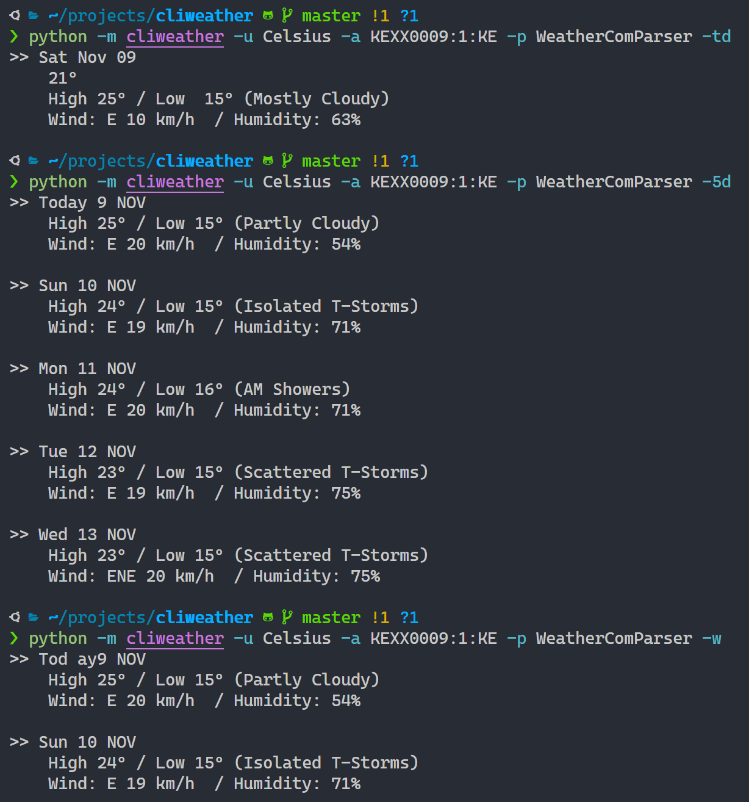

<!-- PROJECT LOGO -->

# CLI Weather

[](https://github.com/austinewuncler/cliweather)

<!-- TABLE OF CONTENTS -->

## Table of Contents

* [About the Project](#about-the-project)
  * [Built With](#built-with)
* [Getting Started](#getting-started)
  * [Prerequisites](#prerequisites)
  * [Installation](#installation)
* [Usage](#usage)
* [Roadmap](#roadmap)
* [Contributing](#contributing)
* [License](#license)
* [Contact](#contact)
* [Acknowledgements](#acknowledgements)

<!-- ABOUT THE PROJECT -->

## About The Project



This is a command line utility to fetch weather forecast from weather.com and other sources

### Built With

* [Python](https://www.python.org)
* [Requests](https://pypi.org/project/requests/)
* [BeautifulSoup](https://pypi.org/project/beautifulsoup4)

<!-- GETTING STARTED -->

## Getting Started

To get a local copy up and running follow these simple example steps.

### Prerequisites

This is an example of how to list things you need to use the software and how to install them.

* pipenv

``` sh
pip install pipenv
```

### Installation

Clone the repo

``` sh
git clone https://github.com/austinewuncler/cliweather.git
```

Install Python packages

``` sh
pipenv install
```

<!-- USAGE EXAMPLES -->

## Usage

To view the help:

``` sh
python -m cliweather -h
```

For example, to get today's weather forecast:

``` sh
python -m cliweather -u Celsius -a KEXX0009:1:KE -p WeatherComParser -td
```

<!-- ROADMAP -->

## Roadmap

See the [open issues](https://github.com/austinewuncler/cliweather/issues) for a list of proposed features (and known issues).

<!-- CONTRIBUTING -->

## Contributing

Contributions are what make the open source community such an amazing place to be learn, inspire, and create. Any contributions you make are **greatly appreciated**.

1. Fork the Project
2. Create your Feature Branch ( `git checkout -b feature/AmazingFeature` )
3. Commit your Changes ( `git commit -m 'Add some AmazingFeature'` )
4. Push to the Branch ( `git push origin feature/AmazingFeature` )
5. Open a Pull Request

<!-- LICENSE -->

## License

Distributed under the MIT License. See `LICENSE` for more information.

<!-- CONTACT -->

## Contact

Austine Were - [@austinewuncler](https://github.com/austinewuncler) - austinewuncler@gmail.com

Project Link: [https://github.com/austinewuncler/cliweather](https://github.com/austinewuncler/cliweather)

<!-- ACKNOWLEDGEMENTS -->

## Acknowledgements

* [Python Programming Blueprints](https://www.packtpub.com/application-development/python-programming-blueprints)

